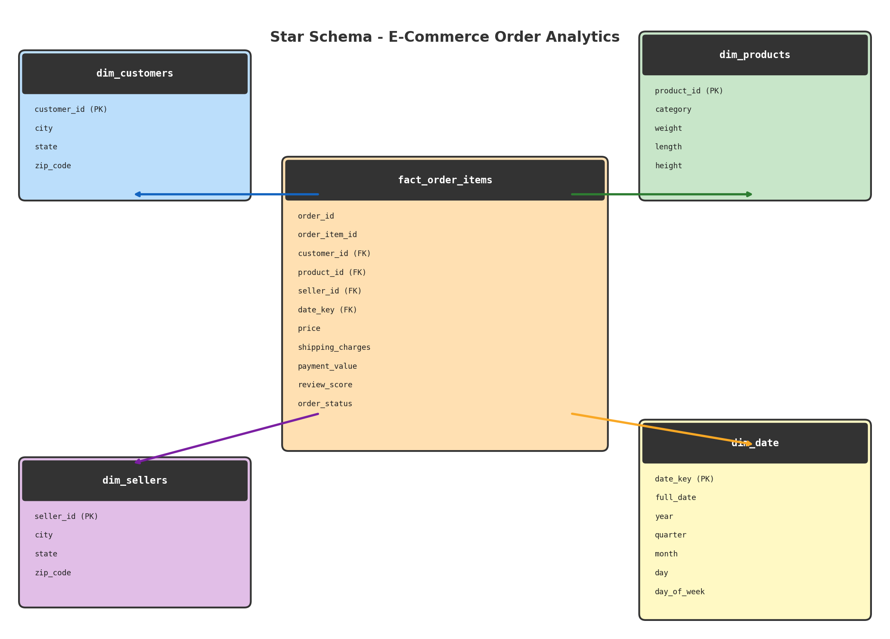

# E-Commerce Order Analytics Platform

## Project Objective

Design, implement, and analyze a real-world e-commerce dataset using a well-structured relational database, an analytics-ready star schema, and automated CI/CD pipelines.

---

## Phase 1: Infrastructure, Modeling, and Data Ingestion

- Designed a **normalized schema (3NF)** with 7 tables
- Created an **ERD (Entity Relationship Diagram)**
- Implemented the schema in **PostgreSQL (Neon Cloud)**
- Built a **Python data ingestion pipeline** (Pandas + SQLAlchemy)
- Ensured **data integrity and idempotency**
- Applied **Role-Based Access Control (RBAC)**

## Phase 2: Transformation, Quality, and CI/CD

- Transformed OLTP schema into an optimized **Star Schema** using **dbt**
- Implemented **43 dbt tests** for data quality (unique, not_null, relationships, accepted_values)
- Generated a **data catalog** with `dbt docs`
- Set up **GitHub Actions CI/CD** with SQLFluff linting and dbt tests on every PR
- Wrote **3 advanced analytical queries** using CTEs and window functions
- Performed **query performance tuning** with strategic indexing and EXPLAIN ANALYZE

---

## Tech Stack

- **Python** (Pandas, SQLAlchemy)
- **PostgreSQL** (Neon Serverless)
- **dbt** (Data Build Tool) for transformations and testing
- **SQLFluff** for SQL linting
- **GitHub Actions** for CI/CD
- **Git/GitHub** for version control

---

## Project Structure

```
E-Commerce-Order-Analytics-Platform/
│
├── data/                          # Raw dataset (9 CSV files)
│
├── scripts/
│   ├── ingest_data.py             # Data loading pipeline
│   └── run_schema.py              # Executes schema.sql
│
├── sql/
│   ├── schema.sql                 # Database schema (3NF tables + constraints)
│   ├── security.sql               # RBAC roles (analyst, app_user)
│   ├── advanced_queries.sql       # 3 complex analytical queries
│   └── indexes.sql                # Strategic performance indexes
│
├── dbt_project/
│   ├── dbt_project.yml            # dbt project configuration
│   ├── profiles.yml               # Database connection profile
│   ├── packages.yml               # dbt packages (dbt_utils)
│   ├── .sqlfluff                  # SQL linter configuration
│   └── models/
│       ├── staging/               # Staging views (clean/rename raw tables)
│       │   ├── _stg_sources.yml   # Source definitions
│       │   ├── _stg_models.yml    # Staging model tests
│       │   ├── stg_customers.sql
│       │   ├── stg_orders.sql
│       │   ├── stg_products.sql
│       │   ├── stg_sellers.sql
│       │   ├── stg_order_items.sql
│       │   ├── stg_payments.sql
│       │   └── stg_reviews.sql
│       └── marts/                 # Star schema (dimension + fact tables)
│           ├── _marts_models.yml  # Mart model tests
│           ├── dim_customers.sql
│           ├── dim_products.sql
│           ├── dim_sellers.sql
│           ├── dim_date.sql
│           └── fact_order_items.sql
│
├── .github/workflows/
│   └── ci.yml                     # CI/CD: SQLFluff lint + dbt test on PR
│
├── docs/
│   └── performance_tuning_report.md
│
├── ERD.png                        # Entity Relationship Diagram (3NF)
├── star_schema.png                # Star Schema Diagram
├── DMQL_3NF_Report.pdf            # 3NF justification report
└── README.md
```

---

## Star Schema Design

The dbt project transforms the normalized 3NF OLTP tables into an optimized star schema for analytics:

| Table | Type | Description | Row Count |
|-------|------|-------------|-----------|
| **fact_order_items** | Fact | Order line items with payment and review metrics | 112,650 |
| **dim_customers** | Dimension | Customer location details | 99,441 |
| **dim_products** | Dimension | Product category and physical attributes | 32,951 |
| **dim_sellers** | Dimension | Seller location details | 3,095 |
| **dim_date** | Dimension | Date attributes (year, quarter, month, day) | 774 |



---

## dbt Tests (43 total)

- **not_null**: All primary keys and foreign keys
- **unique**: All primary keys
- **relationships**: Foreign key integrity between fact and dimension tables
- **accepted_values**: Review scores must be 1-5

---

## Advanced Analytical Queries

1. **Monthly Revenue with MoM Growth** -- Uses CTE + `LAG()` window function
2. **Top 5 Sellers per State with Cumulative Revenue** -- Uses CTE + `RANK()` + cumulative `SUM() OVER`
3. **Customer Cohort Retention Analysis** -- Uses multiple CTEs + date math

See `sql/advanced_queries.sql` for full queries.

---

## CI/CD Pipeline

GitHub Actions workflow (`.github/workflows/ci.yml`) runs on every PR to `main`:

1. **SQLFluff Lint** -- Checks SQL formatting and style
2. **dbt Test** -- Runs all 43 data quality tests

---

## Setup Instructions

### 1. Clone and install

```bash
git clone <your-repo-link>
cd E-Commerce-Order-Analytics-Platform
python3 -m venv venv
source venv/bin/activate
pip install -r requirements.txt
```

### 2. Configure environment

Create `.env` in the project root:
```
DATABASE_URL=your_neon_database_url
```

Create `dbt_project/.env`:
```
DBT_HOST=your_neon_host
DBT_USER=your_neon_user
DBT_PASSWORD=your_neon_password
```

### 3. Run Phase 1 (schema + ingestion)

```bash
python scripts/run_schema.py
python scripts/ingest_data.py
```

### 4. Run Phase 2 (dbt)

```bash
cd dbt_project
export $(cat .env | xargs)
dbt deps
dbt run
dbt test
dbt docs generate
dbt docs serve    # Opens data catalog in browser
```

### 5. GitHub Secrets (for CI/CD)

Add these in GitHub repo Settings > Secrets:
- `DBT_HOST`
- `DBT_USER`
- `DBT_PASSWORD`

---

## Sample Queries

```sql
-- Total revenue
SELECT SUM(payment_value) FROM payments;

-- Orders by status
SELECT order_status, COUNT(*) FROM orders GROUP BY order_status;

-- Top product categories by revenue (using star schema)
SELECT dp.category, SUM(f.price) as revenue
FROM fact_order_items f
JOIN dim_products dp ON f.product_id = dp.product_id
GROUP BY dp.category
ORDER BY revenue DESC
LIMIT 10;
```

---

## Performance Tuning

See [docs/performance_tuning_report.md](docs/performance_tuning_report.md) for the full EXPLAIN ANALYZE report with before/after indexing comparisons.
